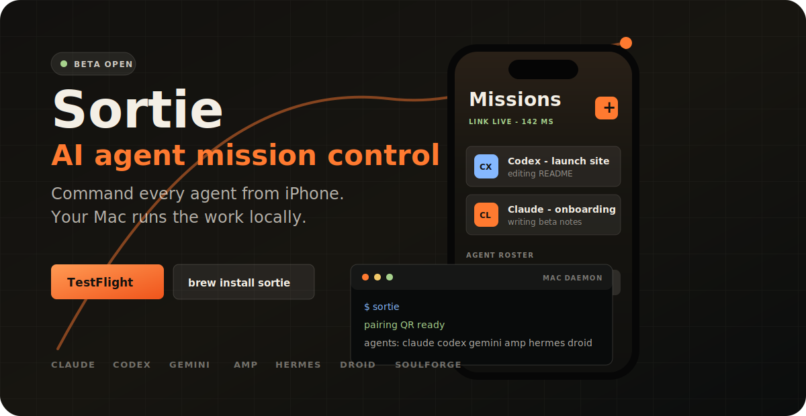

<p align="center">
  
</p>

<p align="center">
  <a href="https://testflight.apple.com/join/1jB6HJ9m"></a>
  <a href="#quick-start"></a>
  <a href="https://github.com/thebasedcapital/sortie/issues/new/choose"></a>
</p>

<h1 align="center">Sortie</h1>

<p align="center">
  <strong>Command every AI agent from your iPhone. Your Mac runs the work locally.</strong>
  <br />
  Claude, Codex, Gemini, Hermes, Pi, Amp, Claw, Kilo, SoulForge, and Droid in one control surface.
</p>

<p align="center">
  <a href="https://testflight.apple.com/join/1jB6HJ9m"><strong>TestFlight</strong></a>
  &nbsp;/&nbsp;
  <a href="#quick-start"><strong>Homebrew install</strong></a>
  &nbsp;/&nbsp;
  <a href="https://sortie.fly.dev"><strong>Landing page</strong></a>
  &nbsp;/&nbsp;
  <a href="https://github.com/thebasedcapital/sortie/issues/new/choose"><strong>Support</strong></a>
</p>

---

## Public Beta Hub

This repository is Sortie's public pre-launch home: beta support, install notes, issue intake, and release-facing documentation. The app and CLI source are private during TestFlight, with source opening planned after v1.0.

<table>
  <tr>
    <td><strong>iPhone app</strong></td>
    <td>Launch, inspect, and resume agent sessions from iOS.</td>
  </tr>
  <tr>
    <td><strong>Mac CLI</strong></td>
    <td>Runs the real local agent process on your linked machine.</td>
  </tr>
  <tr>
    <td><strong>Encrypted relay</strong></td>
    <td>Routes messages while device-held keys protect content.</td>
  </tr>
</table>

## Quick Start

```sh
brew tap thebasedcapital/sortie
brew install sortie
sortie
```

Then install the [iOS TestFlight beta](https://testflight.apple.com/join/1jB6HJ9m), create your account, and scan the QR code shown by your Mac:

```text
Settings -> Account -> Link New Device
```

## Supported Agents

| Beta-ready | Experimental |
| --- | --- |
| Claude, Codex, Gemini | Pi, Claw, Kilo |
| Amp, Hermes, Droid | SoulForge |

## Architecture

```text
┌──────────────────────┐      end-to-end encrypted      ┌──────────────────────┐
│  iPhone Sortie app   │  ◄──────────────────────────►  │  Mac sortie daemon   │
│  command surface     │        libsodium relay         │  local agent runtime │
└──────────────────────┘                                └──────────┬───────────┘
                                                                    │
                                                                    ▼
                                                     ┌─────────────────────────┐
                                                     │ claude / codex / gemini │
                                                     │ amp / hermes / droid    │
                                                     │ pi / claw / ...         │
                                                     └─────────────────────────┘
```

The relay handles auth and routing. Message content stays end-to-end encrypted; keys live on your devices.

## Requirements

- macOS on Apple Silicon or Intel
- Homebrew
- iPhone with iOS 17 or newer
- At least one supported agent CLI installed, such as `claude`, `codex`, or `gemini`

## Report A Bug

Run this first:

```sh
sortie doctor
```

Then [open a bug report](https://github.com/thebasedcapital/sortie/issues/new/choose) with what you did, what you expected, what happened, and the `sortie doctor` output. Screenshots or recordings help for visual issues.

## Links

| Resource | Link |
| --- | --- |
| Landing page | [sortie.fly.dev](https://sortie.fly.dev) |
| TestFlight beta | [testflight.apple.com/join/1jB6HJ9m](https://testflight.apple.com/join/1jB6HJ9m) |
| Homebrew tap | [thebasedcapital/homebrew-sortie](https://github.com/thebasedcapital/homebrew-sortie) |
| Privacy policy | [sortie.fly.dev/privacy.html](https://sortie.fly.dev/privacy.html) |

## License

The CLI is MIT-licensed through the Homebrew tap. The iOS app source is planned to open after v1.0.
